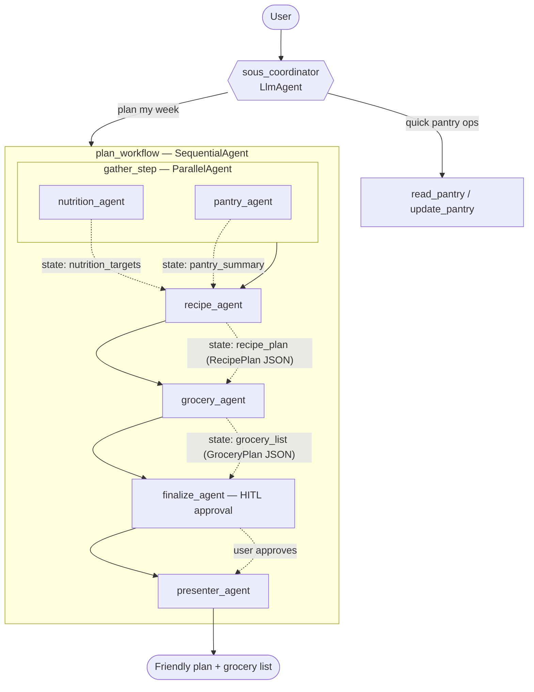

# Architecture

Sous is a multi-agent system built on Google's ADK. A conversational
**coordinator** handles quick memory operations itself and delegates full
meal-planning to a **deterministic workflow** of specialist agents.

## Design decisions

### Two orchestration styles
- **LLM-driven delegation** — the coordinator's `sub_agents` include `plan_workflow`;
  the model decides when to transfer control.
- **Deterministic workflow** — `SequentialAgent(ParallelAgent(nutrition, pantry),
  recipe, grocery)` guarantees ordering and lets the two independent lookups run
  concurrently.

### Context passing between stages
Each pipeline agent has an `output_key`, writing its result to session state.
Downstream agents pull it via `{key?}` templating in their instructions (e.g. the
recipe agent reads `{nutrition_targets?}` and `{pantry_summary?}`). This is the
"context as source code" pattern — each agent sees only what it needs.

### Memory
Memory works at three layers, all wired on the coordinator (`src/sous/memory.py`):

1. **Durable structured state.** The pantry and profile live under `user:`-scoped
   state keys (e.g. `user:pantry`). With the SQLite-backed `DatabaseSessionService`,
   `user:` state survives across separate sessions for the same user, while
   unprefixed state stays session-local. See `tests/test_state.py` for the proof.

2. **History compaction** (`before_model_callback` → `compact_history`). Before each
   coordinator model call, the conversation is trimmed to a sliding window of the
   last `SOUS_HISTORY_WINDOW` turns (default 12); when a summariser is configured, the
   dropped prefix is folded into a running summary stored under a *session-scoped*
   key (`history_summary`) and prepended as one synthetic turn. This bounds the token
   footprint of long chats. It only rewrites `llm_request.contents` — the transient
   conversation — so durable `user:` state is never affected. The trimmed window is
   sanitised to a boundary the model accepts: a leading orphaned `function_response`
   (whose `function_call` was dropped) is removed, and a pure trim opens on a `user`
   turn. The summariser is injectable, so the trigger/threshold logic is unit-tested
   without a live LLM (`tests/test_compaction.py`).

3. **Long-term memory** (`after_agent_callback` → `remember_session`). After the
   user-facing reply is produced, the finished turn is ingested into a `MemoryService`
   via `await callback_context.add_session_to_memory()` — off the response critical
   path. The coordinator recalls those facts in later sessions through the ADK
   `load_memory` tool. `get_memory_service()` in `runtime.py` mirrors the session-service
   factory: an `InMemoryMemoryService` (keyword search) by default, or the managed
   `VertexAiMemoryBankService` (semantic search) when `SOUS_MEMORY_BACKEND=vertex`.
   Cross-session recall is proven in `tests/test_memory.py`.

### Strategic model routing (issue #7)
Agents are routed across two model tiers by task complexity rather than all sharing
one model (`src/sous/agent.py`):

- **`FAST_MODEL`** (default `gemini-3.6-flash`) — the simple specialists and final
  rendering: `nutrition_agent`, `pantry_agent`, `finalize_agent`, `presenter_agent`.
- **`SMART_MODEL`** (default `gemini-pro-latest`) — the reasoning-heavy steps:
  `recipe_agent` (meal selection), `grocery_agent` (list aggregation) and the
  `sous_coordinator` (delegation/routing).

Both tiers are env-overridable (`SOUS_FAST_MODEL` / `SOUS_SMART_MODEL`), and the
pre-existing `SOUS_MODEL` still works as a single back-compat knob that pins both.
The tier resolution is a pure function (`_tier_models`), unit-tested without a live
model. (ADK's experimental `RoutedLlm` per-request router is not yet in the released
SDK, so routing is expressed as static per-task tiers.)

### Runtime guardrails (issue #7)
Batch evaluation checks behaviour offline; a `PolicyPlugin` (`src/sous/plugins.py`)
enforces policy **at runtime**. It subclasses ADK's `BasePlugin` and is registered
once on the `App` in `build_runner`, so its `before_tool_callback` applies globally
to every agent and tool — plugin callbacks also run *before* agent-local callbacks
like `compact_history`. Returning a `dict` short-circuits the call (that dict becomes
the tool result and the real tool never runs); returning `None` lets it proceed. The
shipped policy caps a single `update_pantry` write at `MAX_PANTRY_ITEMS_PER_CALL`
items, refusing runaway/hallucinated bulk writes before they touch state.

### Human-in-the-loop (issue #7)
Two high-stakes actions pause for explicit user approval via ADK tool confirmation
(`FunctionTool(require_confirmation=True)`):

1. **Pantry writes** — `update_pantry` mutates persisted `user:` state, so every
   write is gated (`update_pantry_tool`). Reads (`read_pantry`) stay ungated.
2. **Final plan approval** — a `finalize_agent` sits between `grocery_agent` and
   `presenter_agent` and calls the confirmation-gated `finalize_plan`. The plan is
   only presented once the user approves.

When a gated tool is called, ADK pauses the run and emits an
`adk_request_confirmation` request; the client resumes by returning a
`FunctionResponse` carrying a `ToolConfirmation` with `confirmed=True/False`.

A `SequentialAgent` doesn't branch, so a *pause* suspends the pipeline but an
explicit *rejection* would otherwise fall through to the presenter. The finalize
gate closes that gap with two callbacks: `finalize_agent.after_tool_callback`
(`record_plan_approval`) records the approve/reject outcome to session state under
`plan_approved`, and `presenter_agent.before_agent_callback` (`guard_presentation`)
returns a short "tell me what to change" message — short-circuiting the presenter's
model call — when the outcome is a rejection. It fails open (renders) when the gate
was never reached, and closed only on an explicit `False`. The gating and the
rejection halt are unit-tested headlessly (`tests/test_hitl.py`) across the pause,
approve and reject paths.

### Why the classic workflow agents
ADK 2.x flags `SequentialAgent`/`ParallelAgent` as deprecated in favour of the new
graph `Workflow`. We keep the classic agents because (a) the new `Workflow` cannot
yet be an `LlmAgent` sub-agent — which would break coordinator delegation — and
(b) they are the canonical way to express the Sequential/Parallel pipeline. They
remain fully functional.

## Tools

All tools are pure Python functions (no LLM calls), so they are unit-tested
independently of the model.

| Tool | Agent | Purpose |
|------|-------|---------|
| `search_recipes` | recipe_agent | Filter catalogue by tags, allergens, cost, cook time |
| `compute_nutrition_targets` | nutrition_agent | Daily kcal + macro targets for a goal |
| `read_pantry` / `update_pantry` | coordinator, pantry_agent | Read/mutate `user:pantry` (writes are HITL-confirmed) |
| `build_grocery_list` | grocery_agent | Consolidate ingredients, subtract pantry |
| `finalize_plan` | finalize_agent | HITL approval gate before the plan is presented |
| `load_memory` (ADK built-in) | coordinator | Recall facts from past sessions before re-asking |

## Schemas & validation

Contracts are enforced end-to-end with Pydantic (`src/sous/schemas.py`), not just
type hints — this is the robustness layer on top of the descriptive tool docstrings.

- **Tool inputs** — each tool validates its arguments against a strict input model
  (`ConfigDict(extra="forbid")` + `Field` bounds, e.g. `weight_kg` in `(0, 500]`,
  `meals_per_day` in `[1, 6]`). Constrained values use `Literal` types
  (`goal`: lose/maintain/gain, `action`: add/remove) so ADK surfaces them to the
  model as JSON-schema **enum** constraints. Validation failures are converted to
  the guided `{"status": "error", "error_message": ...}` response — never a
  raised traceback reaching the LLM.
- **Tool outputs** — every tool builds a typed result model (`SearchRecipesResult`,
  `NutritionTargets`, `PantryState`, `GroceryList`, `ErrorResult`) and returns
  `.model_dump()`, so the shape can't silently drift.
- **Agent output** — `recipe_agent` and `grocery_agent` set `output_schema`
  (`RecipePlan` / `GroceryPlan`), emitting validated JSON into state instead of
  free text. This uses Gemini 3.x's support for `output_schema` **with** tools in
  a single request (on other models, use a tool-less formatter). A final
  `presenter_agent` (no schema/tools) then renders that structured state as the
  friendly, conversational reply — so the pipeline keeps machine-checked contracts
  internally while the user still gets prose. The full pipeline is verified live in
  `tests/test_eval.py`.
- **Dataset** — `Recipe`/`Macros`/`Ingredient` are strict Pydantic models; tags
  and allergens are checked against controlled vocabularies and macros/cost/time
  are bounded, so a malformed dataset entry fails fast at load time.

## Observability & evaluation

Four layers, wired together in `src/sous/observability.py`. They're registered on a
module-level `app` (`src/sous/runtime.py`, re-exported as `sous.app`), which ADK's
agent loader discovers for `adk web`/`adk api_server` — it looks for `sous.app`
before falling back to `root_agent`. So the plugins and the logging/telemetry config
are active in the primary run path, not only when `build_runner` is called
programmatically (issue #9):

- **Tracing** — ADK emits OpenTelemetry spans for every agent hop and tool call,
  visible in the `adk web` Trace tab or exportable with `--trace_to_cloud`.
- **Structured JSON logging** — all app logging goes through loguru with a JSON sink
  (`serialize=True`); `SOUS_LOG_LEVEL` sets the level. Events carry structured
  context via `logger.bind(...)`, so they're machine-parseable by a log aggregator.
- **Intent / outcome capture** — an `ObservabilityPlugin` (`BasePlugin`, registered
  on the `App` alongside `PolicyPlugin`) emits a structured **intent** event
  (`on_user_message_callback`), **tool outcome** events (`after_tool_callback` — this
  also captures the HITL approve/reject and the guardrail block via the tool's
  status), and a **run outcome** event (`after_run_callback`), all correlated by
  invocation id. The same run is thus both traced (OTel) and summarised (logs).
- **PII redaction** — one policy (`PII_KEYS` + `redact`) defined once and applied in
  both places PII could escape:
  - *Logs* — a global loguru patcher (`logger.configure(patcher=...)`) masks any
    value under a PII key (weight, allergens, goal, pantry, raw user text), wherever
    it appears in a record's `extra` — including nested tool args/results. Redaction
    can't be forgotten at a call site.
  - *Traces* — ADK captures message content in some span attributes
    (`gcp.vertex.agent.tool_call_args` / `tool_response`) **by default**, which would
    include those same tool args. `configure_telemetry()` defaults
    `ADK_CAPTURE_MESSAGE_CONTENT_IN_SPANS=false` (prevention at source; still opt-in
    to re-enable), so PII never enters the spans in the first place — cleaner than
    scrubbing immutable, already-recorded spans.
- **Evals** — `src/sous/eval/pantry_smoke.evalset.json` with thresholds in
  `test_config.json`, wired into pytest (`-m llm`) and runnable via `adk eval`.
