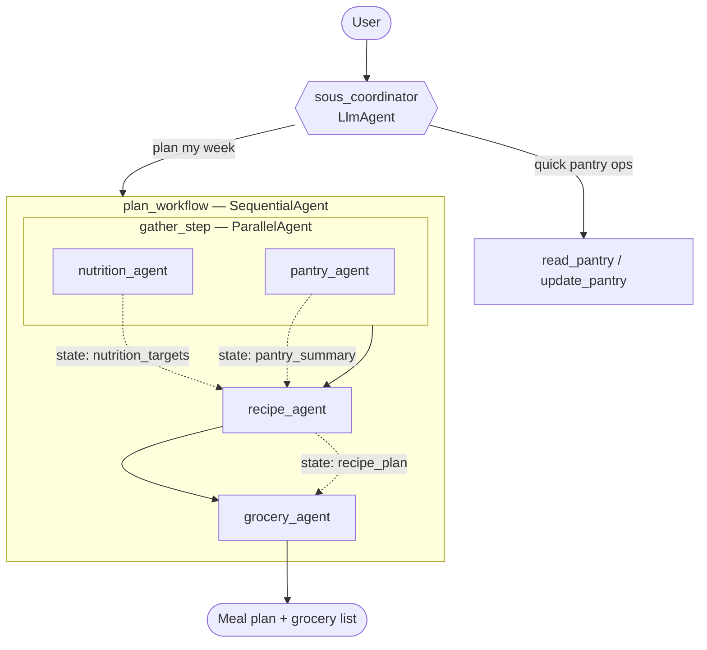

# Architecture

Sous is a multi-agent system built on Google's ADK. A conversational
**coordinator** handles quick memory operations itself and delegates full
meal-planning to a **deterministic workflow** of specialist agents.

## Design decisions

### Two orchestration styles
- **LLM-driven delegation** — the coordinator's `sub_agents` include `plan_workflow`;
  the model decides when to transfer control.
- **Deterministic workflow** — `SequentialAgent(ParallelAgent(nutrition, pantry),
  recipe, grocery)` guarantees ordering and lets the two independent lookups run
  concurrently.

### Context passing between stages
Each pipeline agent has an `output_key`, writing its result to session state.
Downstream agents pull it via `{key?}` templating in their instructions (e.g. the
recipe agent reads `{nutrition_targets?}` and `{pantry_summary?}`). This is the
"context as source code" pattern — each agent sees only what it needs.

### Memory
The pantry and profile live under `user:`-scoped state keys (e.g. `user:pantry`).
With the SQLite-backed `DatabaseSessionService`, `user:` state survives across
separate sessions for the same user, while unprefixed state stays session-local.
See `tests/test_state.py` for the proof.

### Why the classic workflow agents
ADK 2.x flags `SequentialAgent`/`ParallelAgent` as deprecated in favour of the new
graph `Workflow`. We keep the classic agents because (a) the new `Workflow` cannot
yet be an `LlmAgent` sub-agent — which would break coordinator delegation — and
(b) they are the canonical way to express the Sequential/Parallel pipeline. They
remain fully functional.

## Tools

All tools are pure Python functions (no LLM calls), so they are unit-tested
independently of the model.

| Tool | Agent | Purpose |
|------|-------|---------|
| `search_recipes` | recipe_agent | Filter catalogue by tags, allergens, cost, cook time |
| `compute_nutrition_targets` | nutrition_agent | Daily kcal + macro targets for a goal |
| `read_pantry` / `update_pantry` | coordinator, pantry_agent | Read/mutate `user:pantry` |
| `build_grocery_list` | grocery_agent | Consolidate ingredients, subtract pantry |

## Observability & evaluation

- **Tracing** — ADK emits OpenTelemetry spans for every agent hop and tool call,
  visible in the `adk web` Trace tab or exportable with `--trace_to_cloud`.
- **Evals** — `src/sous/eval/pantry_smoke.evalset.json` with thresholds in
  `test_config.json`, wired into pytest (`-m llm`) and runnable via `adk eval`.
