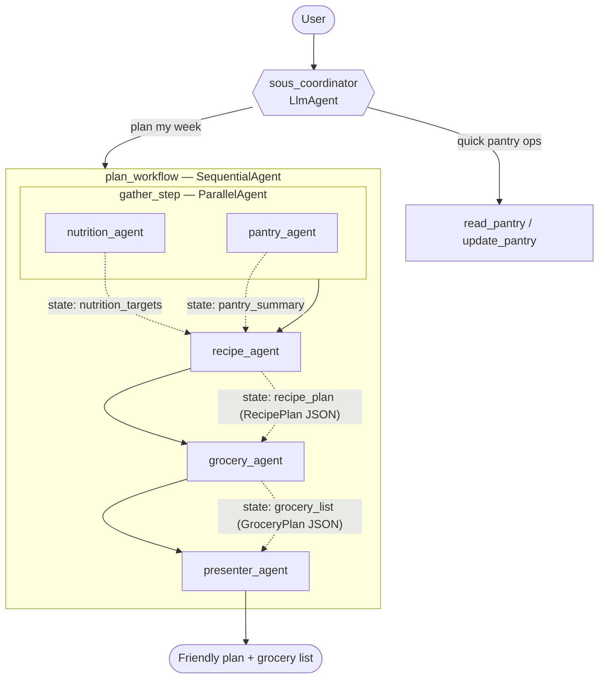

# Architecture

Sous is a multi-agent system built on Google's ADK. A conversational
**coordinator** handles quick memory operations itself and delegates full
meal-planning to a **deterministic workflow** of specialist agents.

## Design decisions

### Two orchestration styles
- **LLM-driven delegation** — the coordinator's `sub_agents` include `plan_workflow`;
  the model decides when to transfer control.
- **Deterministic workflow** — `SequentialAgent(ParallelAgent(nutrition, pantry),
  recipe, grocery)` guarantees ordering and lets the two independent lookups run
  concurrently.

### Context passing between stages
Each pipeline agent has an `output_key`, writing its result to session state.
Downstream agents pull it via `{key?}` templating in their instructions (e.g. the
recipe agent reads `{nutrition_targets?}` and `{pantry_summary?}`). This is the
"context as source code" pattern — each agent sees only what it needs.

### Memory
Memory works at three layers, all wired on the coordinator (`src/sous/memory.py`):

1. **Durable structured state.** The pantry and profile live under `user:`-scoped
   state keys (e.g. `user:pantry`). With the SQLite-backed `DatabaseSessionService`,
   `user:` state survives across separate sessions for the same user, while
   unprefixed state stays session-local. See `tests/test_state.py` for the proof.

2. **History compaction** (`before_model_callback` → `compact_history`). Before each
   coordinator model call, the conversation is trimmed to a sliding window of the
   last `SOUS_HISTORY_WINDOW` turns (default 12); when a summariser is configured, the
   dropped prefix is folded into a running summary stored under a *session-scoped*
   key (`history_summary`) and prepended as one synthetic turn. This bounds the token
   footprint of long chats. It only rewrites `llm_request.contents` — the transient
   conversation — so durable `user:` state is never affected. The summariser is
   injectable, so the trigger/threshold logic is unit-tested without a live LLM
   (`tests/test_compaction.py`).

3. **Long-term memory** (`after_agent_callback` → `remember_session`). After the
   user-facing reply is produced, the finished turn is ingested into a `MemoryService`
   via `await callback_context.add_session_to_memory()` — off the response critical
   path. The coordinator recalls those facts in later sessions through the ADK
   `load_memory` tool. `get_memory_service()` in `runtime.py` mirrors the session-service
   factory: an `InMemoryMemoryService` (keyword search) by default, or the managed
   `VertexAiMemoryBankService` (semantic search) when `SOUS_MEMORY_BACKEND=vertex`.
   Cross-session recall is proven in `tests/test_memory.py`.

### Why the classic workflow agents
ADK 2.x flags `SequentialAgent`/`ParallelAgent` as deprecated in favour of the new
graph `Workflow`. We keep the classic agents because (a) the new `Workflow` cannot
yet be an `LlmAgent` sub-agent — which would break coordinator delegation — and
(b) they are the canonical way to express the Sequential/Parallel pipeline. They
remain fully functional.

## Tools

All tools are pure Python functions (no LLM calls), so they are unit-tested
independently of the model.

| Tool | Agent | Purpose |
|------|-------|---------|
| `search_recipes` | recipe_agent | Filter catalogue by tags, allergens, cost, cook time |
| `compute_nutrition_targets` | nutrition_agent | Daily kcal + macro targets for a goal |
| `read_pantry` / `update_pantry` | coordinator, pantry_agent | Read/mutate `user:pantry` |
| `build_grocery_list` | grocery_agent | Consolidate ingredients, subtract pantry |
| `load_memory` (ADK built-in) | coordinator | Recall facts from past sessions before re-asking |

## Schemas & validation

Contracts are enforced end-to-end with Pydantic (`src/sous/schemas.py`), not just
type hints — this is the robustness layer on top of the descriptive tool docstrings.

- **Tool inputs** — each tool validates its arguments against a strict input model
  (`ConfigDict(extra="forbid")` + `Field` bounds, e.g. `weight_kg` in `(0, 500]`,
  `meals_per_day` in `[1, 6]`). Constrained values use `Literal` types
  (`goal`: lose/maintain/gain, `action`: add/remove) so ADK surfaces them to the
  model as JSON-schema **enum** constraints. Validation failures are converted to
  the guided `{"status": "error", "error_message": ...}` response — never a
  raised traceback reaching the LLM.
- **Tool outputs** — every tool builds a typed result model (`SearchRecipesResult`,
  `NutritionTargets`, `PantryState`, `GroceryList`, `ErrorResult`) and returns
  `.model_dump()`, so the shape can't silently drift.
- **Agent output** — `recipe_agent` and `grocery_agent` set `output_schema`
  (`RecipePlan` / `GroceryPlan`), emitting validated JSON into state instead of
  free text. This uses Gemini 3.x's support for `output_schema` **with** tools in
  a single request (on other models, use a tool-less formatter). A final
  `presenter_agent` (no schema/tools) then renders that structured state as the
  friendly, conversational reply — so the pipeline keeps machine-checked contracts
  internally while the user still gets prose. The full pipeline is verified live in
  `tests/test_eval.py`.
- **Dataset** — `Recipe`/`Macros`/`Ingredient` are strict Pydantic models; tags
  and allergens are checked against controlled vocabularies and macros/cost/time
  are bounded, so a malformed dataset entry fails fast at load time.

## Observability & evaluation

- **Tracing** — ADK emits OpenTelemetry spans for every agent hop and tool call,
  visible in the `adk web` Trace tab or exportable with `--trace_to_cloud`.
- **Evals** — `src/sous/eval/pantry_smoke.evalset.json` with thresholds in
  `test_config.json`, wired into pytest (`-m llm`) and runnable via `adk eval`.
